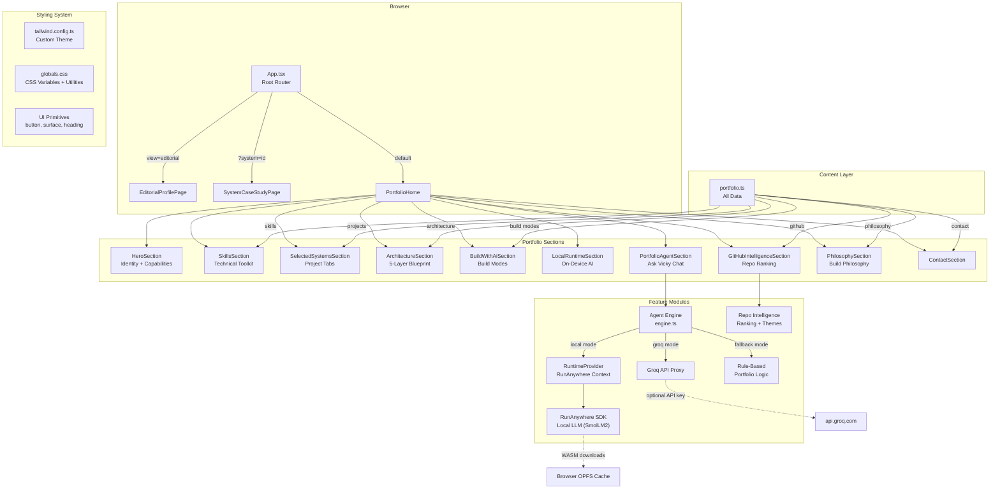
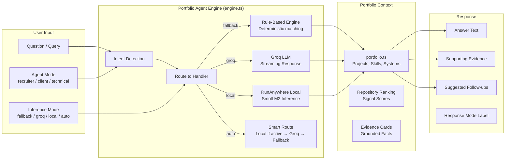
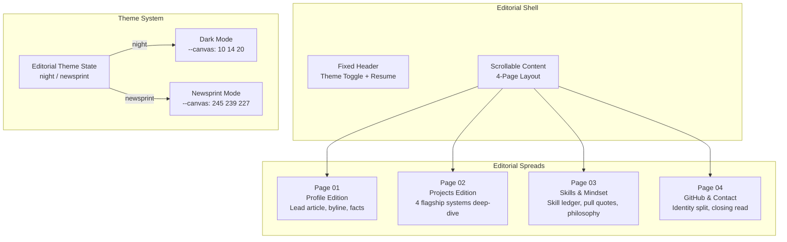

# Contribution Guide

## Overview

Portfolio website for Vicky Kumar — an AI Engineer / Software Engineer portfolio built with **React 18**, **TypeScript**, **Vite**, and **Tailwind CSS**. Features include a local on-device AI runtime (RunAnywhere SDK), a portfolio agent with Groq/rule-based fallback, GitHub intelligence layer, and a full editorial profile page.

---

## Prerequisites

- **Node.js** >= 18
- **npm** >= 9
- (Optional) `GROQ_API_KEY` for the live inference agent

---

## Quick Start

```bash
# Clone
git clone https://github.com/FiscalMindset/algsochvicky.git
cd algsochvicky

# Install
npm install

# Copy environment
cp .env.example .env
# Edit .env and add GROQ_API_KEY if desired

# Dev server
npm run dev
```

Opens at `http://localhost:5173`

---

## Available Commands

| Command | Description |
|---------|-------------|
| `npm run dev` | Start Vite dev server with HMR |
| `npm run build` | TypeScript check + Vite production build |
| `npm run preview` | Preview the production build locally |
| `npm run typecheck` | TypeScript type checking only |

---

## Project Architecture

```
src/
├── app/
│   └── App.tsx                  # Root — route to portfolio / editorial
├── components/
│   ├── pages/                    # Full page components
│   │   ├── editorial-profile-page.tsx
│   │   └── system-case-study-page.tsx
│   ├── sections/                 # Portfolio sections
│   │   ├── hero-section.tsx      # Entry point with identity + capabilities
│   │   ├── skills-section.tsx    # Technical toolkit grid
│   │   ├── selected-systems-section.tsx  # Project deep-dive tabs
│   │   ├── architecture-section.tsx      # 5-layer blueprint
│   │   ├── build-with-ai-section.tsx     # Build modes explorer
│   │   ├── local-runtime-section.tsx     # On-device AI control panel
│   │   ├── portfolio-agent-section.tsx   # Ask Vicky chat
│   │   ├── github-intelligence-section.tsx  # Repo ranking + stats
│   │   ├── philosophy-section.tsx   # Build philosophy
│   │   ├── contact-section.tsx   # Contact + conversion paths
│   │   ├── capability-strip-section.tsx
│   │   ├── audience-routes-section.tsx
│   │   └── nav-shell.tsx         # Sticky nav bar
│   ├── ui/                       # Reusable UI primitives
│   │   ├── button.tsx
│   │   ├── section-heading.tsx
│   │   ├── surface.tsx
│   │   ├── github-commit-surface.tsx
│   │   ├── rich-response.tsx
│   │   └── youtube-preview.tsx
│   └── visuals/                  # Visual + diagram components
│       ├── architecture-blueprint.tsx
│       └── hero-signal-map.tsx
├── content/
│   └── portfolio.ts              # All portfolio data (projects, skills, etc.)
├── features/
│   ├── agent/                    # Portfolio agent engine
│   │   ├── engine.ts             # Core answer logic + routing
│   │   ├── groq-provider.ts      # Groq API integration
│   │   └── types.ts              # Agent types
│   ├── github/                   # GitHub repo intelligence
│   │   └── repo-intelligence.ts  # Ranking + theme filtering
│   └── runanywhere/              # RunAnywhere SDK integration
│       ├── model-catalog.ts      # Local model definitions
│       ├── runtime-manager.ts    # Lifecycle management
│       ├── runtime-provider.tsx  # React context provider
│       ├── sdk.ts                # SDK bridge
│       └── types.ts
├── hooks/
│   └── use-active-section.ts     # Scroll-based section tracking
├── lib/
│   └── utils.ts                  # Utility functions
├── styles/
│   └── globals.css               # Tailwind base + custom utilities
├── main.tsx                      # React entry point
└── vite-env.d.ts
```

### Architecture Flow



### Agent Inference Architecture



### Editorial Profile Architecture



---

## How to Contribute

### 1. Branch

```bash
git checkout -b fix/your-fix-name
# or
git checkout -b feature/your-feature-name
```

### 2. Make changes

- Edit sections in `src/components/sections/`
- Add/modify portfolio data in `src/content/portfolio.ts`
- Run `npm run typecheck` to verify types

### 3. Commit

```bash
git add .
npm run typecheck     # ensure no type errors
npm run build         # ensure build passes
git commit -m "description of changes"
```

Note: This repo uses **LiveReview** pre-commit hooks. If blocked, run:

```bash
lrc review --staged --vouch   # manually approve
# or
lrc review --staged --skip    # skip AI review
```

### 4. Push & PR

```bash
git push -u origin your-branch-name
# Create PR on GitHub: https://github.com/FiscalMindset/algsochvicky/pulls
```

---

## Environment Variables

| Variable | Required | Description |
|----------|----------|-------------|
| `GROQ_API_KEY` | No | API key for Groq inference in the portfolio agent |
| `GROQ_MODEL` | No | Model override (default: `llama-3.1-8b-instant`) |
| `VITE_GROQ_PROXY_URL` | No | Custom Groq proxy endpoint |

---

## Deployment

This portfolio deploys on **Render** (primary) and **Vercel** (secondary).

### Render

- Build command: `npm run build`
- Publish directory: `dist`
- Auto-deploys from `main` branch

### Vercel

- Framework preset: Vite
- Build command: `npm run build`
- Output directory: `dist`

---

## Design Conventions

- **Border system**: Sections have responsive outer borders — `rounded-xl border` on mobile, `sm:rounded-2xl sm:border-2`, `lg:rounded-3xl`
- **Section spacing**: `section-space` utility = `py-6 sm:py-8 lg:py-12`
- **Colors**: Defined as CSS variables in `globals.css` (canvas, ink, accent, line, etc.)
- **Typography**: `font-display` (Syne), `font-sans` (Manrope), `font-mono` (JetBrains Mono)
- **Components keep data separate** — portfolio content lives in `src/content/portfolio.ts`, not in components
