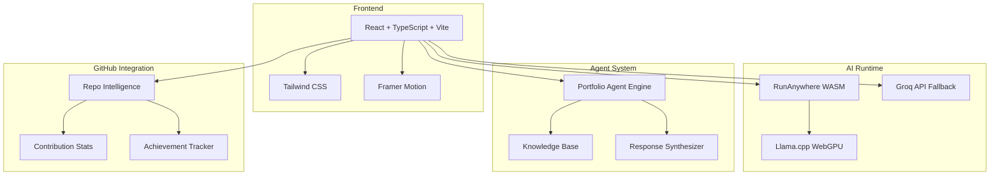
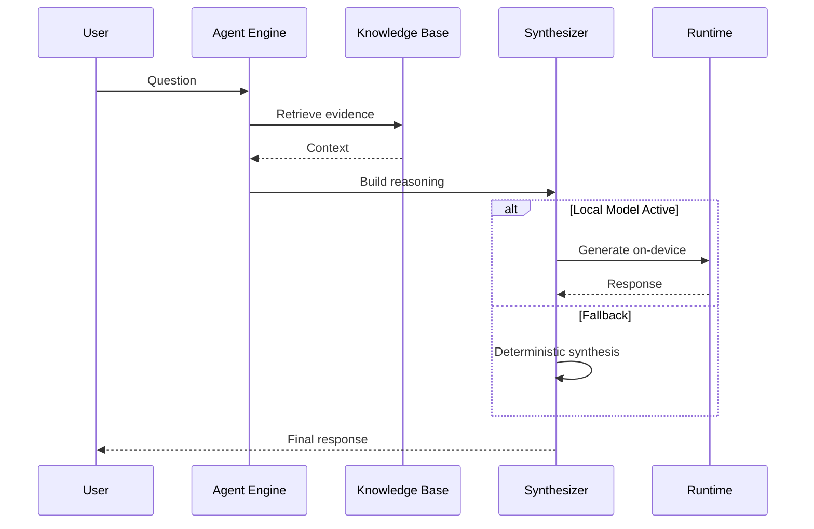
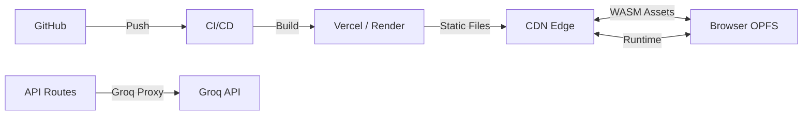

<!-- Profile Section -->
<table>
<tr>
<td rowspan="3">

</td>
<td>

# Vicky Kumar

**Software Engineer** · **AI Engineer** · **Agentic Systems Builder**

[](https://github.com/FiscalMindset)
[](https://www.linkedin.com/in/algsoch)
[](https://algsochvicky.onrender.com)

Building AI products and real-world systems

</td>
</tr>
</table>

---

## 🏅 GitHub Achievements

<div style="display: flex; gap: 16px; flex-wrap: wrap;">

[](https://github.com/FiscalMindset?achievement=pull-shark&tab=achievements)
[](https://github.com/FiscalMindset?achievement=yolo&tab=achievements)
[](https://github.com/FiscalMindset?achievement=quickdraw&tab=achievements)

</div>

| Achievement | Description | Earned |
|-------------|-------------|--------|
| 🦈 Pull Shark | 22+ pull requests merged | ✅ |
| 💥 YOLO | Merged PR without review | ✅ |
| ⚡ Quickdraw | PR merged in < 5 minutes | ✅ |

---

## 📊 GitHub Stats

### @FiscalMindset (Primary)

| Metric | Count |
|--------|-------|
| ⬆️ Commits | 42 |
| 🔀 Pull Requests | 22 |
| 🐛 Issues | 12 |
| 📦 Public Repos | 20 |
| ⭐ Stars | 6 |

### @algsoch (Legacy)

| Metric | Count |
|--------|-------|
| ⬆️ Commits | 217 |
| 🔀 Pull Requests | 28 |
| 📦 Public Repos | 107 |
| ⭐ Stars | 24 |
| 👥 Followers | 6 |

---

## 🐙 Coral MCP Contributions

**12 PRs** merged/open to [withcoral/coral](https://github.com/withcoral/coral)

| Source | PR | Status |
|--------|-----|--------|
| Voyage AI | [#1115](https://github.com/withcoral/coral/pull/1115) | ✅ Merged |
| Sarvam AI | [#1112](https://github.com/withcoral/coral/pull/1112) | ✅ Merged |
| Cohere AI | [#1098](https://github.com/withcoral/coral/pull/1098) | ✅ Merged |
| Mistral AI | [#1011](https://github.com/withcoral/coral/pull/1011) | ✅ Merged |
| OpenRouter | [#882](https://github.com/withcoral/coral/pull/882) | ✅ Merged |
| LM Studio | [#834](https://github.com/withcoral/coral/pull/834) | ✅ Merged |
| Ollama | [#798](https://github.com/withcoral/coral/pull/798) | ✅ Merged |
| Groq AI | [#754](https://github.com/withcoral/coral/pull/754) | ✅ Merged |
| Deepgram ASR | [#1118](https://github.com/withcoral/coral/pull/1118) | 🔄 Open |
| NVIDIA NIM | [#958](https://github.com/withcoral/coral/pull/958) | 🔄 Open |

---

## 🛠️ Tech Stack

**Frontend**


**AI/ML**


**Tools**


---

## 📐 Architecture Overview

### System Architecture



### Agent Response Pipeline



### Deployment Architecture



---

## 📁 Project Structure

```
vicky/
├── src/
│   ├── app/
│   │   └── App.tsx              # Main app shell
│   ├── components/
│   │   ├── sections/            # Page sections
│   │   │   ├── hero-section.tsx
│   │   │   ├── github-intelligence-section.tsx
│   │   │   ├── portfolio-agent-section.tsx
│   │   │   └── local-runtime-section.tsx
│   │   └── ui/                  # Design system
│   ├── content/
│   │   └── portfolio.ts         # Central content config
│   ├── features/
│   │   ├── agent/               # Portfolio agent
│   │   ├── github/              # GitHub integration
│   │   └── runanywhere/         # Local AI runtime
│   └── styles/
│       └── globals.css          # Design tokens
├── api/
│   └── groq.js                  # Groq proxy for Vercel
├── server/
│   └── groq-proxy.mjs           # Render deployment
├── public/
│   └── images/
│       └── vicky-kumar.png      # Profile photo
└── render.yaml                  # Render blueprint
```

---

## 🚀 Getting Started

```bash
# Clone the repository
git clone https://github.com/FiscalMindset/algsochvicky.git
cd algsochvicky

# Install dependencies
npm install

# Start development server
npm run dev

# Production build
npm run build
```

### Environment Variables

Create a `.env` file:

```bash
GROQ_API_KEY=your_key_here
GROQ_MODEL=llama-3.1-8b-instant
VITE_GROQ_PROXY_URL=
```

---

## 🎯 Key Features

| Feature | Description |
|---------|-------------|
| 🤖 Portfolio Agent | Interactive AI agent with 5 modes (Recruiter, Client, Technical, Project Explorer, AI Capability) |
| 🖥️ Local Runtime | Browser-local AI inference via RunAnywhere WASM |
| 📊 GitHub Intelligence | Dual-account stats, achievements, Coral MCP contributions |
| 🌙 Dark Theme | Premium dark technical luxury design |
| 📱 Responsive | Mobile-first responsive layout |
| ⚡ Fast | Vite-powered builds with code splitting |

---

## 📜 License

MIT License - feel free to use this as a template for your own portfolio.

---

## 📬 Contact

- **GitHub**: [@FiscalMindset](https://github.com/FiscalMindset)
- **LinkedIn**: [algsoch](https://www.linkedin.com/in/algsoch)
- **Portfolio**: [algsochvicky.onrender.com](https://algsochvicky.onrender.com)