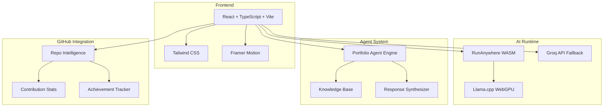
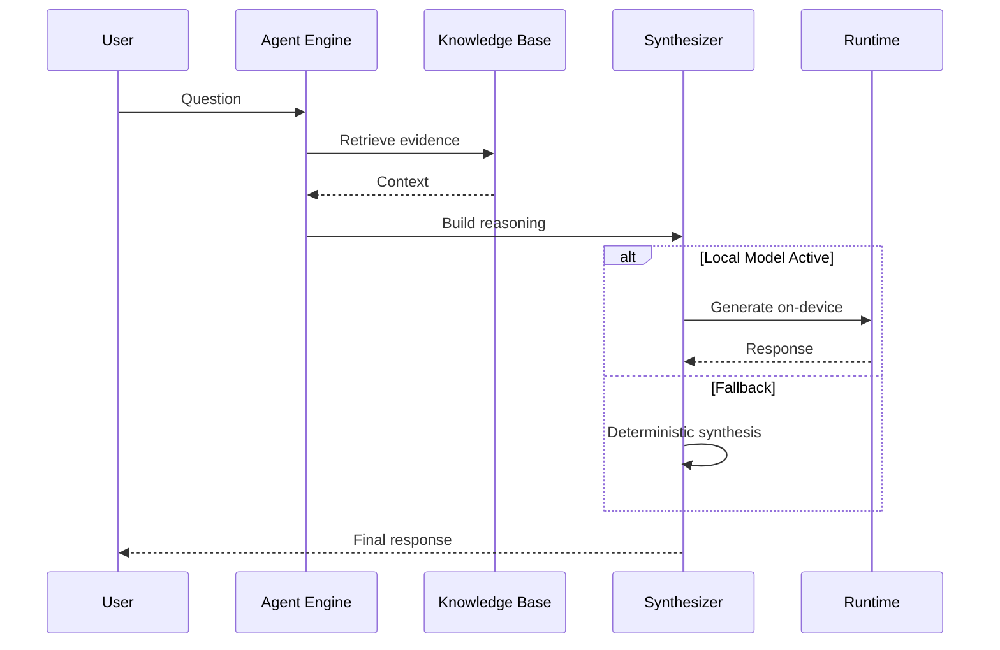
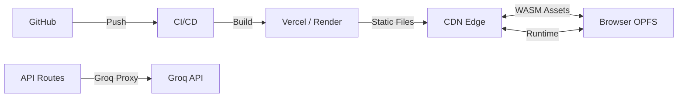

<!-- Profile Section -->
<p align="center">
  
  <br><br>
  <strong>Vicky Kumar</strong>
  <br>
  <em>Software Engineer · AI Engineer · Agentic Systems Builder</em>
  <br><br>
  <a href="https://github.com/FiscalMindset"></a>
  <a href="https://www.linkedin.com/in/algsoch"></a>
  <a href="https://algsochvicky.onrender.com"></a>
  <br><br>
  Building AI products and real-world systems
</p>

---

## 📊 GitHub Stats

### @FiscalMindset (Primary Account)

| Metric | Count |
|--------|-------|
| ⬆️ Commits | 42 |
| 🔀 Pull Requests | 22 |
| 🐛 Issues | 12 |
| 📦 Public Repos | 20 |
| ⭐ Stars | 6 |

**Location:** Ghevra, Delhi, India

**Projects:**
- [algsochvicky](https://github.com/FiscalMindset/algsochvicky) - This portfolio website (TypeScript, React)
- [coral](https://github.com/FiscalMindset/coral) - One SQL interface over APIs, files, and live sources — built for agents (Rust)
- [careops](https://github.com/FiscalMindset/careops) - Coral-powered family care coordination agent (2 stars)
- [opencode](https://github.com/FiscalMindset/opencode) - The open source coding agent
- [nsut_bot](https://github.com/FiscalMindset/nsut_bot) - NSUT Bot (Kotlin)

### @algsoch (Legacy Account)

| Metric | Count |
|--------|-------|
| ⬆️ Commits | 217 |
| 🔀 Pull Requests | 28 |
| 📦 Public Repos | 107 |
| ⭐ Stars | 24+ |
| 👥 Followers | 6 |

**Bio:** "I build systems that combine strong backend engineering with practical AI capabilities."

**Location:** Ghevra, Delhi, India

**Company:** algsoch

**Recent Projects:**
| Repo | Language | Description | Stars |
|------|----------|-------------|-------|
| [nsut_bot](https://github.com/algsoch/nsut_bot) | Kotlin | 🤖 NSUT Bot | ⭐ 2 |
| [speakai](https://github.com/algsoch/speakai) | TypeScript | 🎤 SpeakAI - Voice AI | ⭐ 1 |
| [brain_tumor](https://github.com/algsoch/brain_tumor) | Jupyter | 🧠 Brain Tumor Detection | - |
| [Cognivise](https://github.com/algsoch/Cognivise) | JavaScript | 🧠 Cognition + Vision | - |
| [html-checker](https://github.com/algsoch/html-checker) | CSS | 📝 HTML Checker | ⭐ 1 |
| [smart_terminal](https://github.com/algsoch/smart_terminal) | TypeScript | 💻 Local command for smart terminal | - |
| [accomplish](https://github.com/algsoch/accomplish) | TypeScript | ✨ Open source AI coworker | - |

---

## 🐙 Coral MCP Contributions

**12 PRs** merged/open to [withcoral/coral](https://github.com/withcoral/coral) — CLA Signed

| Source | PR | Status |
|--------|-----|--------|
| Voyage AI | [#1115](https://github.com/withcoral/coral/pull/1115) | ✅ Merged |
| Sarvam AI | [#1112](https://github.com/withcoral/coral/pull/1112) | ✅ Merged |
| Cohere AI | [#1098](https://github.com/withcoral/coral/pull/1098) | ✅ Merged |
| Mistral AI | [#1011](https://github.com/withcoral/coral/pull/1011) | ✅ Merged |
| OpenRouter | [#882](https://github.com/withcoral/coral/pull/882) | ✅ Merged |
| LM Studio | [#834](https://github.com/withcoral/coral/pull/834) | ✅ Merged |
| Ollama | [#798](https://github.com/withcoral/coral/pull/798) | ✅ Merged |
| Groq AI | [#754](https://github.com/withcoral/coral/pull/754) | ✅ Merged |
| Deepgram ASR | [#1118](https://github.com/withcoral/coral/pull/1118) | 🔄 Open |
| NVIDIA NIM | [#958](https://github.com/withcoral/coral/pull/958) | 🔄 Open |

[View all PRs →](https://github.com/withcoral/coral/pulls?q=author%3AFiscalMindset)

---

## 🛠️ Tech Stack

**Frontend**
| React | TypeScript | Tailwind CSS | Vite |
|-------|------------|--------------|------|
|  |  |  |  |

**AI/ML**
| Python | TensorFlow | PyTorch |
|--------|------------|---------|
|  |  |  |

**Backend & Tools**
| Node.js | Rust | Git | Kotlin |
|---------|------|-----|--------|
|  |  |  |  |

---

## 🚀 Featured Projects

### Android AI Apps
| Project | Description | Language |
|---------|-------------|----------|
| [algsoch](https://github.com/FiscalMindset/algsoch) | Android AI news app with on-device intelligence (107K+ downloads) | Kotlin |
| [algsochnews](https://github.com/FiscalMindset/algsochnews) | Multi-agent AI newsroom system | Python |

### AI/ML Systems
| Project | Description | Stars |
|---------|-------------|-------|
| [brain_tumor](https://github.com/algsoch/brain_tumor) | 97.9% accuracy CNN model (EfficientNetB3) | - |
| [Synapse-Graph](https://github.com/FiscalMindset/Synapse-Graph) | AI autopsy engine for neural governance | - |
| [Kairon](https://github.com/FiscalMindset/Kairon) | AI-powered system automation platform | - |

### Agentic Systems
| Project | Description |
|---------|-------------|
| [CommandBrain](https://github.com/algsoch/CommandBrain) | Command systems AI |
| [SpeakAI](https://github.com/algsoch/speakai) | Voice AI system |
| [careops](https://github.com/FiscalMindset/careops) | Family care coordination agent |

---

## 📐 Architecture Overview

### System Architecture



### Agent Response Pipeline



### Deployment Architecture



---

## 📁 Project Structure

```
vicky/
├── src/
│   ├── app/
│   │   └── App.tsx              # Main app shell
│   ├── components/
│   │   ├── sections/            # Page sections
│   │   │   ├── hero-section.tsx
│   │   │   ├── github-intelligence-section.tsx
│   │   │   ├── portfolio-agent-section.tsx
│   │   │   └── local-runtime-section.tsx
│   │   └── ui/                  # Design system
│   ├── content/
│   │   └── portfolio.ts         # Central content config
│   ├── features/
│   │   ├── agent/               # Portfolio agent
│   │   ├── github/              # GitHub integration
│   │   └── runanywhere/         # Local AI runtime
│   └── styles/
│       └── globals.css          # Design tokens
├── api/
│   └── groq.js                  # Groq proxy for Vercel
├── server/
│   └── groq-proxy.mjs           # Render deployment
├── public/
│   └── images/
│       └── vicky-kumar.png      # Profile photo
└── render.yaml                  # Render blueprint
```

---

## 🚀 Getting Started

```bash
# Clone the repository
git clone https://github.com/FiscalMindset/algsochvicky.git
cd algsochvicky

# Install dependencies
npm install

# Start development server
npm run dev

# Production build
npm run build
```

### Environment Variables

Create a `.env` file:

```bash
GROQ_API_KEY=your_key_here
GROQ_MODEL=llama-3.1-8b-instant
VITE_GROQ_PROXY_URL=
```

---

## 🎯 Key Features

| Feature | Description |
|---------|-------------|
| 🤖 Portfolio Agent | Interactive AI agent with 5 modes (Recruiter, Client, Technical, Project Explorer, AI Capability) |
| 🖥️ Local Runtime | Browser-local AI inference via RunAnywhere WASM |
| 📊 GitHub Intelligence | Dual-account stats, achievements, Coral MCP contributions |
| 🌙 Dark Theme | Premium dark technical luxury design |
| 📱 Responsive | Mobile-first responsive layout |
| ⚡ Fast | Vite-powered builds with code splitting |

---

## 🏅 GitHub Achievements

| Achievement | Icon | Description |
|-------------|------|-------------|
| Pull Shark |  | 22+ pull requests merged |
| YOLO |  | Merged PR without review |
| Quickdraw |  | PR merged in < 5 minutes |

[View all achievements →](https://github.com/FiscalMindset?tab=achievements)

---

## 📜 License

MIT License - feel free to use this as a template for your own portfolio.

---

## 📬 Contact

- **GitHub**: [@FiscalMindset](https://github.com/FiscalMindset) | [@algsoch](https://github.com/algsoch)
- **LinkedIn**: [algsoch](https://www.linkedin.com/in/algsoch)
- **Twitter**: [@algsoch](https://twitter.com/algsoch)
- **Portfolio**: [algsochvicky.onrender.com](https://algsochvicky.onrender.com)