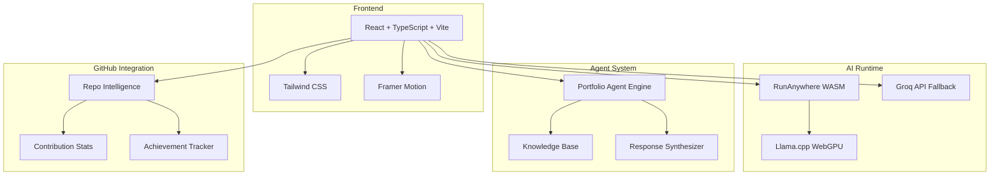
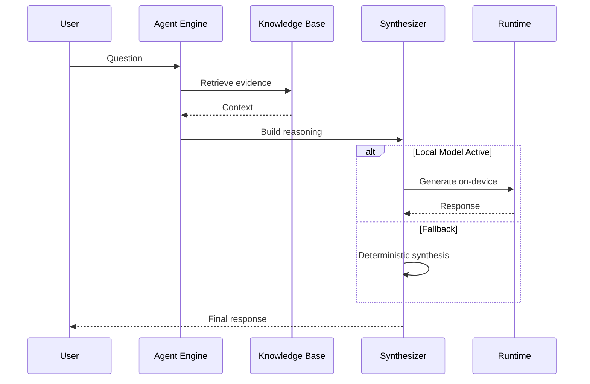

<p align="center">
  
  <br><br>
  <strong>Vicky Kumar</strong>
  <br>
  <em>Software Engineer · AI Engineer · Agentic Systems Builder</em>
  <br><br>
  <a href="https://github.com/FiscalMindset"></a>
  <a href="https://github.com/algsoch"></a>
  <a href="https://www.linkedin.com/in/algsoch"></a>
  <a href="https://algsochvicky.onrender.com"></a>
  <br><br>
  Building AI products and real-world systems
</p>

---

## 🚀 Featured Projects

### 🤖 AI Systems (Built by Me)

| Project | Account | Description | Status |
|---------|---------|-------------|--------|
| [algsochnews](https://github.com/FiscalMindset/algsochnews) | @FiscalMindset | Multi-agent AI newsroom that turns a public news URL into a broadcast screenplay, visible agent workflow, and rendered video | ⭐ Original |
| [Synapse-Graph](https://github.com/FiscalMindset/Synapse-Graph) | @FiscalMindset | AI autopsy engine that repurposes OpenMetadata for live neural governance, tracing and quarantining hallucinating attention heads at runtime | 🔥 Original |
| [careops](https://github.com/FiscalMindset/careops) | @FiscalMindset | Coral-powered family care coordination agent connecting patient records, prescription photos, lab PDFs, doctor chats into a doctor-visit packet | 🆕 Original |
| [cognifyz](https://github.com/algsoch/cognifyz) | @algsoch | AI-powered data processing and transformation platform | 🔧 Original |

### 📱 Android Applications

| Project | Account | Description | Downloads |
|---------|---------|-------------|-----------|
| [algsoch](https://github.com/algsoch/algsoch) | @algsoch | Android AI news app with on-device intelligence | 107K+ |

### 🧠 ML/AI Projects

| Project | Account | Description | Accuracy |
|---------|---------|-------------|----------|
| [brain_tumor](https://github.com/algsoch/brain_tumor) | @algsoch | Brain tumor detection using CNN image processing | 97.9% |
| [Cognivise](https://github.com/algsoch/Cognivise) | @algsoch | Cognition + Vision → Clean, powerful, memorable | - |
| [deep_learning](https://github.com/algsoch/deep_learning) | @algsoch | Deep learning experiments and models | - |
| [chatbot_assistant](https://github.com/algsoch/chatbot_assistant) | @algsoch | AI chatbot implementation | - |

### 🛠️ Developer Tools

| Project | Account | Description |
|---------|---------|-------------|
| [html-checker](https://github.com/algsoch/html-checker) | @algsoch | Web app to clean HTML code from unwanted tags like cite_start |
| [smart_terminal](https://github.com/algsoch/smart_terminal) | @algsoch | Local command for smart terminal |
| [women](https://github.com/algsoch/women) | @algsoch | Safety and empowerment platform |

### 📚 Learning & Experiments

| Project | Account | Description |
|---------|---------|-------------|
| [100-days-of-machine-learning](https://github.com/algsoch/100-days-of-machine-learning) | @algsoch | ML learning journey |
| [langchain](https://github.com/algsoch/langchain) | @algsoch | LangChain experiments |
| [python_library_machine_learning](https://github.com/algsoch/python_library_machine_learning) | @algsoch | ML library implementations |

---

## 🛠️ Tech Stack

| Category | Technologies |
|----------|--------------|
| **Frontend** | React, TypeScript, Tailwind CSS, Vite |
| **Backend** | Node.js, Rust |
| **AI/ML** | Python, TensorFlow, PyTorch, LangChain |
| **Mobile** | Kotlin (Android) |
| **Tools** | Git, GitHub, Coral MCP |

---

## 📊 GitHub Stats

### @FiscalMindset (Primary Account)

| Metric | Count |
|--------|-------|
| 📦 Public Repos | 20 |
| ⭐ Stars | 6 |
| ⬆️ Commits | 42 |
| 🔀 PRs | 22 |
| 🐛 Issues | 12 |

### @algsoch (Original Projects Account)

| Metric | Count |
|--------|-------|
| 📦 Public Repos | 107+ |
| ⭐ Stars | 24+ |
| ⬆️ Commits | 217 |
| 🔀 PRs | 28 |
| 👥 Followers | 6 |

---

## 🐙 Coral MCP Contributions

Contributed 12 PRs to [withcoral/coral](https://github.com/withcoral/coral) — CLA Signed

| Source | PR | Status |
|--------|-----|--------|
| Voyage AI | [#1115](https://github.com/withcoral/coral/pull/1115) | ✅ Merged |
| Sarvam AI | [#1112](https://github.com/withcoral/coral/pull/1112) | ✅ Merged |
| Cohere AI | [#1098](https://github.com/withcoral/coral/pull/1098) | ✅ Merged |
| Mistral AI | [#1011](https://github.com/withcoral/coral/pull/1011) | ✅ Merged |
| OpenRouter | [#882](https://github.com/withcoral/coral/pull/882) | ✅ Merged |
| LM Studio | [#834](https://github.com/withcoral/coral/pull/834) | ✅ Merged |
| Ollama | [#798](https://github.com/withcoral/coral/pull/798) | ✅ Merged |
| Groq AI | [#754](https://github.com/withcoral/coral/pull/754) | ✅ Merged |
| Deepgram ASR | [#1118](https://github.com/withcoral/coral/pull/1118) | 🔄 Open |
| NVIDIA NIM | [#958](https://github.com/withcoral/coral/pull/958) | 🔄 Open |

[View all PRs →](https://github.com/withcoral/coral/pulls?q=author%3AFiscalMindset)

---

## 🏅 GitHub Achievements

| Achievement | Icon | Description |
|-------------|------|-------------|
| Pull Shark |  | 22+ PRs merged |
| YOLO |  | Merged PR without review |
| Quickdraw |  | PR merged in < 5 min |

[View all →](https://github.com/FiscalMindset?tab=achievements)

---

## 📐 Architecture Overview

### System Architecture



### Agent Response Pipeline



---

## 📁 Project Structure

```
vicky/
├── src/
│   ├── app/App.tsx           # Main app shell
│   ├── components/
│   │   ├── sections/         # Page sections
│   │   └── ui/               # Design system
│   ├── content/
│   │   └── portfolio.ts      # Central content config
│   ├── features/
│   │   ├── agent/            # Portfolio agent
│   │   ├── github/           # GitHub integration
│   │   └── runanywhere/      # Local AI runtime
│   └── styles/globals.css    # Design tokens
├── api/groq.js               # Groq proxy
├── server/groq-proxy.mjs     # Render deployment
└── public/images/            # Assets
```

---

## 🚀 Getting Started

```bash
# Clone and install
git clone https://github.com/FiscalMindset/algsochvicky.git
cd algsochvicky
npm install

# Development
npm run dev

# Production build
npm run build
```

### Environment Variables

```bash
GROQ_API_KEY=your_key_here
GROQ_MODEL=llama-3.1-8b-instant
```

---

## 📜 License

MIT License

---

## 📬 Contact

- **@FiscalMindset**: [GitHub](https://github.com/FiscalMindset)
- **@algsoch**: [GitHub](https://github.com/algsoch)
- **LinkedIn**: [algsoch](https://www.linkedin.com/in/algsoch)
- **Portfolio**: [algsochvicky.onrender.com](https://algsochvicky.onrender.com)