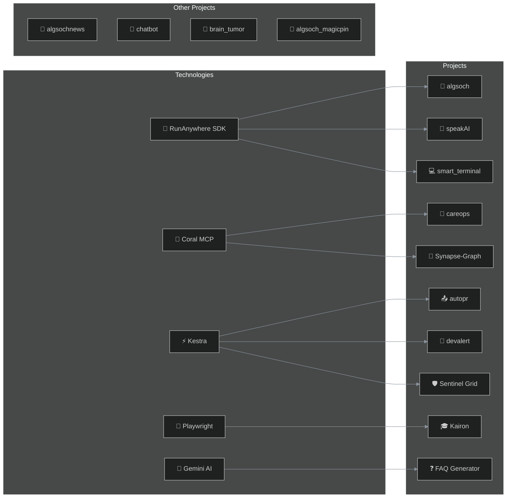

  
    
  <strong>Vicky Kumar</strong>
   
  <em>Software Engineer · AI Engineer · Agentic Systems Builder</em>
    
  
  
  
  
    
  Building AI products and real-world systems

---

## 🔗 Project Ecosystem

---

## 🚀 Featured Projects

### 🤖 AI Systems (Android + On-Device)

| Project | Account | Description | Website |
|---------|---------|-------------|---------|
| [algsoch](https://github.com/FiscalMindset/algsoch) | @FiscalMindset | AI Study Companion for Android — 100% offline with RunAnywhere SDK, SmolLM2/SmolVLM models | [📱 APK](https://github.com/FiscalMindset/algsoch/releases) |
| [speakAI](https://github.com/algsoch/speakai) | @algsoch | SpeakAI — Local English Practice, runs 100% on device with RunAnywhere Web SDK | [🌐 Live](https://speakai-af1l.onrender.com/) |
| [algsochnews](https://github.com/FiscalMindset/algsochnews) | @FiscalMindset | Multi-agent AI newsroom — turns URL into broadcast screenplay with visible agent workflow | [🌐 Live](https://algsochnews-1.onrender.com) |

### 🧠 Neural & Governance AI

| Project | Account | Description | Website |
|---------|---------|-------------|---------|
| [Synapse-Graph](https://github.com/FiscalMindset/Synapse-Graph) | @FiscalMindset | AI autopsy engine — traces and quarantines hallucinating attention heads at runtime | [🌐 Live](https://fiscalmindset.github.io/Synapse-Graph/) |
| [brain_tumor](https://github.com/algsoch/brain_tumor) | @algsoch | CNN-based brain tumor detection with 97.9% accuracy using EfficientNetB3 | [🌐 Live](https://brain-tumor-mcug.onrender.com/) |

### 🏥 AI Agents (Coral-Powered)

| Project | Account | Description |
|---------|---------|-------------|
| [careops](https://github.com/FiscalMindset/careops) | @FiscalMindset | Coral-powered family care coordination — joins medical records via 9 Coral sources |

### ⚡ Workflow Automation (Kestra-Powered)

| Project | Account | Description |
|---------|---------|-------------|
| [autopr](https://github.com/FiscalMindset/autopr) | @FiscalMindset | AI Content Orchestration — transforms commits to multi-platform posts |
| [devalert](https://github.com/FiscalMindset/devalert) | @FiscalMindset | Kestra-orchestrated alert platform — aggregates opportunities |
| [women](https://github.com/FiscalMindset/women) | @FiscalMindset | **Sentinel Grid** — Kestra-powered emergency response |

### 🎓 Education & Utilities

| Project | Account | Description | Website |
|---------|---------|-------------|---------|
| [Kairon](https://github.com/FiscalMindset/Kairon) | @FiscalMindset | NSUT Smart Attendance Assistant — Playwright-based | - |
| [FAQ](https://github.com/FiscalMindset/FAQ) | @FiscalMindset | MERN stack FAQ with AI-powered generation using Google Gemini Pro | [🌐 Live](https://faq-v300.onrender.com) |
| [chatbot_assistant](https://github.com/algsoch/chatbot_assistant) | @algsoch | Vicky Data Science Assistant — pattern recognition query solver | [🌐 Live](https://tds-assistant.onrender.com/) |

### 🛡️ Safety & Social Impact

| Project | Account | Description |
|---------|---------|-------------|
| [algsoch_social](https://github.com/FiscalMindset/algsoch_social) | @FiscalMindset | Open-source AI infrastructure for builders |

### 🏪 Industry Projects

| Project | Account | Description | Website |
|---------|---------|-------------|---------|
| [algsoch_magicpin](https://github.com/FiscalMindset/algsoch_magicpin) | @FiscalMindset | AI-powered WhatsApp merchant assistant for magicpin AI Challenge | [🌐 Live](https://algsoch-magicpin.onrender.com) |

### 📐 Blueprints & Experiments

| Project | Account | Description | Website |
|---------|---------|-------------|---------|
| [smart_terminal](https://github.com/algsoch/smart_terminal) | @algsoch | RunAnywhere CommandBrain — Offline-first command memory | [🌐 Live](https://smart-terminal.onrender.com/) |
| [html-checker](https://github.com/algsoch/html-checker) | @algsoch | Web app to clean HTML code | [🌐 Live](https://html-checker-1.onrender.com) |

### 📚 Learning & Experiments

| Project | Account | Description |
|---------|---------|-------------|
| [Cognivise](https://github.com/algsoch/Cognivise) | @algsoch | Cognition + Vision |
| [100-days-of-machine-learning](https://github.com/algsoch/100-days-of-machine-learning) | @algsoch | ML learning journey |
| [langchain](https://github.com/algsoch/langchain) | @algsoch | LangChain experiments |

---

## 📚 Technologies I Work With

### 🤖 AI & ML

| Technology | Description |
|------------|-------------|
| 🤖 RunAnywhere SDK | On-device AI inference, offline-first apps |
| 🧠 TensorFlow | CNN models, brain tumor detection (97.9%) |
| 🔗 LangChain | LLM chains and agents |
| 💎 Gemini AI | Multi-modal AI for FAQ generation |
| 🦙 Ollama | Local LLM inference |
| 🧬 SmolLM2/SmolVLM | Lightweight on-device models |

### 🐙 Workflow & Integration

| Technology | Description |
|------------|-------------|
| 🐙 Coral MCP | Cross-source SQL queries, 12 PRs merged |
| ⚡ Kestra | Declarative workflow orchestration |
| 🦾 Playwright | Web scraping, automation |
| 🔄 Temporal | Distributed workflow engine |

### 🛠️ Full-Stack

| Technology | Description |
|------------|-------------|
| ⚛️ React / Next.js | Frontend frameworks |
| 🔷 TypeScript | Type-safe JavaScript |
| 🎨 Tailwind CSS | Utility-first styling |
| 🐍 Python | Backend, AI/ML |
| ⚡ FastAPI | Python REST API framework |
| 🟢 Node.js | JavaScript runtime |

### 📱 Mobile

| Technology | Description |
|------------|-------------|
| 🤖 Kotlin | Android development |
| 📦 Android | Mobile platform |

### ☁️ Cloud & DevOps

| Technology | Description |
|------------|-------------|
| 🚀 Render | Deployment platform |
| 🌐 Vercel | Frontend hosting |
| 🐙 GitHub | Version control |
| 🔀 GitHub Actions | CI/CD pipelines |

---

## 💻 IDEs & Tools

| Tool | Description | Link |
|------|-------------|------|
| ⚡ OpenCode | AI coding environment | [opencode.ai](https://opencode.ai) |
| 🔮 Codex | OpenAI's coding assistant | [codex.so](https://codex.so) |
| 🦞 OpenClaw | Claude-powered IDE | [openclaw.dev](https://openclaw.dev) |
| 📘 VS Code | Visual Studio Code | [code.visualstudio.com](https://code.visualstudio.com) |
| 🍲 Kimchi | Custom dev environment | [GitHub](https://github.com/raphyr-dev/kimchi) |
| 🤖 GitHub Copilot | AI pair programmer | [copilot.github.com](https://github.com/features/copilot) |
| 📐 Cursor | AI-first IDE | [cursor.com](https://www.cursor.com) |
| 🐚 Terminal | Command line interface | - |

---

## 🌟 Open Source Contributions

### 🐙 Coral MCP — 12 PRs

**CLA Signed Contributor** to [withcoral/coral](https://github.com/withcoral/coral)

| Status | Count |
|--------|-------|
| ✅ Merged | 9 |
| 🔄 Open | 2 |
| 📊 Total | 12 |

**Sources Added:**
Voyage AI, Sarvam AI, Cohere AI, Mistral AI, OpenRouter, LM Studio, Ollama, Groq AI, Deepgram ASR, NVIDIA NIM

---

## 📊 GitHub Stats

### @FiscalMindset (Primary Account)

| Metric | Count |
|--------|-------|
| 📦 Repositories | 20 |
| ⭐ Stars | 6 |
| ⬆️ Commits | 42 |
| 🔀 PRs | 22 |
| 🐛 Issues | 12 |
| 👥 Followers | 3 |

### @algsoch (Original Projects Account)

| Metric | Count |
|--------|-------|
| 📦 Repositories | 107+ |
| ⭐ Stars | 24+ |
| ⬆️ Commits | 217 |
| 🔀 PRs | 28 |
| 👥 Followers | 6 |
| 🎯 Contributions | 350 |

---

## 🏅 GitHub Achievements

| Achievement | Icon | Description |
|-------------|------|-------------|
| Pull Shark |  | 22+ PRs merged |
| YOLO |  | PR merged without review |
| Quickdraw |  | PR merged < 5 min |

[View all achievements →](https://github.com/FiscalMindset?tab=achievements)

---

## 📜 License

MIT License

---

## 📬 Contact

| Platform | Link |
|----------|------|
| GitHub @FiscalMindset | [github.com/FiscalMindset](https://github.com/FiscalMindset) |
| GitHub @algsoch | [github.com/algsoch](https://github.com/algsoch) |
| LinkedIn | [linkedin.com/in/algsoch](https://www.linkedin.com/in/algsoch) |
| Portfolio | [algsochvicky.onrender.com](https://algsochvicky.onrender.com) |