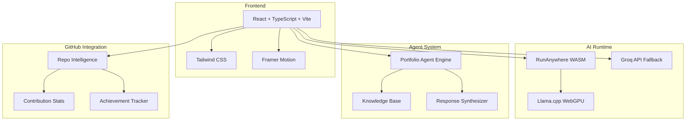
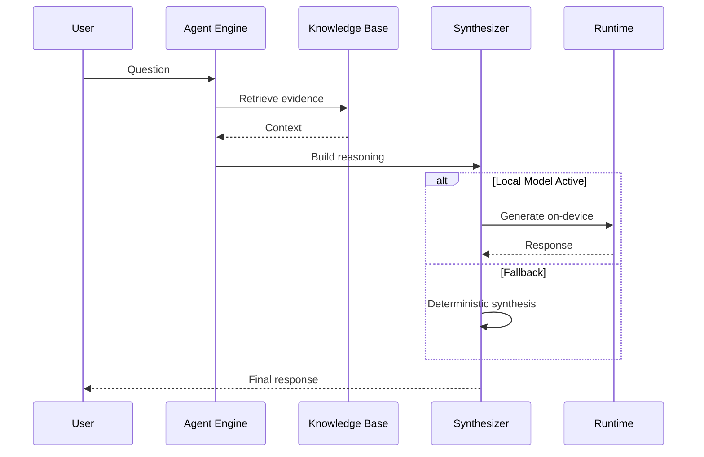

<p align="center">
  
  <br><br>
  <strong>Vicky Kumar</strong>
  <br>
  <em>Software Engineer · AI Engineer · Agentic Systems Builder</em>
  <br><br>
  <a href="https://github.com/FiscalMindset"></a>
  <a href="https://github.com/algsoch"></a>
  <a href="https://www.linkedin.com/in/algsoch"></a>
  <a href="https://algsochvicky.onrender.com"></a>
  <br><br>
  Building AI products and real-world systems
</p>

---

## 🚀 Featured Projects

### 🤖 AI Systems

| Project | Account | Description | Website |
|---------|---------|-------------|---------|
| [algsoch](https://github.com/FiscalMindset/algsoch) | @FiscalMindset | AI Study Companion for Android — 100% offline with RunAnywhere SDK, SmolLM2/SmolVLM models | [📱 APK](https://github.com/FiscalMindset/algsoch/releases) |
| [algsochnews](https://github.com/FiscalMindset/algsochnews) | @FiscalMindset | Multi-agent AI newsroom — turns URL into broadcast screenplay with visible agent workflow | [🌐 Live](https://algsochnews-1.onrender.com) |
| [Synapse-Graph](https://github.com/FiscalMindset/Synapse-Graph) | @FiscalMindset | AI autopsy engine for neural governance — traces and quarantines hallucinating attention heads | [🌐 Live](https://fiscalmindset.github.io/Synapse-Graph/) |
| [careops](https://github.com/FiscalMindset/careops) | @FiscalMindset | Coral-powered family care coordination — connects patient records, prescriptions, labs into doctor-visit packets | - |

### 🧠 ML/AI + Voice AI Projects

| Project | Account | Description | Website |
|---------|---------|-------------|---------|
| [brain_tumor](https://github.com/algsoch/brain_tumor) | @algsoch | CNN-based brain tumor detection with 97.9% accuracy (EfficientNetB3) | [🌐 Live](https://brain-tumor-mcug.onrender.com/) |
| [Cognivise](https://github.com/algsoch/Cognivise) | @algsoch | Cognition + Vision — Clean, powerful, memorable | - |
| [chatbot_assistant](https://github.com/algsoch/chatbot_assistant) | @algsoch | Vicky Data Science Assistant — pattern recognition based query solver for data science problems | [🌐 Live](https://tds-assistant.onrender.com/) |
| [deep_learning](https://github.com/algsoch/deep_learning) | @algsoch | Deep learning experiments and models | - |
| [speakai](https://github.com/algsoch/speakai) | @algsoch | SpeakAI — Local English Practice, runs 100% on device with RunAnywhere Web SDK | - |

### 🛠️ Developer Tools

| Project | Account | Description | Website |
|---------|---------|-------------|---------|
| [html-checker](https://github.com/algsoch/html-checker) | @algsoch | Web app to clean HTML code from unwanted tags like cite_start | [🌐 Live](https://html-checker-1.onrender.com) |
| [smart_terminal](https://github.com/algsoch/smart_terminal) | @algsoch | RunAnywhere CommandBrain — Offline-first command memory + execution copilot | [🌐 Live](https://smart-terminal.onrender.com/) |
| [women](https://github.com/algsoch/women) | @algsoch | Safety and empowerment platform | - |

### 📚 Learning & Experiments

| Project | Account | Description |
|---------|---------|-------------|
| [100-days-of-machine-learning](https://github.com/algsoch/100-days-of-machine-learning) | @algsoch | ML learning journey |
| [langchain](https://github.com/algsoch/langchain) | @algsoch | LangChain experiments |
| [python_library_machine_learning](https://github.com/algsoch/python_library_machine_learning) | @algsoch | ML library implementations |

---

## 🛠️ Tech Stack

| Category | Technologies |
|----------|--------------|
| **Frontend** | React, TypeScript, Tailwind CSS, Vite |
| **Backend** | Node.js, Rust, Python |
| **AI/ML** | TensorFlow, PyTorch, LangChain, OpenAI |
| **Mobile** | Kotlin (Android) |
| **Tools** | Git, GitHub, Coral MCP, Render, Vercel |

---

## 📊 GitHub Stats

<table align="center" style="border-collapse: collapse; width: 100%; max-width: 800px;">
  <tr>
    <td width="50%" style="vertical-align: top; padding: 16px; border: 1px solid #333; border-radius: 12px; background: #0d1117;">
      <h3 align="center" style="margin: 0 0 8px 0;">
        <a href="https://github.com/FiscalMindset" style="text-decoration: none; color: #FF6B6B;">@FiscalMindset</a>
      </h3>
      <p align="center" style="margin: 0 0 16px 0; font-size: 12px; color: #8b949e;">Primary Account</p>
      <table align="center" style="border-collapse: collapse; width: 100%;">
        <tr>
          <td style="padding: 10px; text-align: center; border-top: 1px solid #21262d;">
            <div style="font-size: 28px; font-weight: bold; color: #c9d1d9;">20</div>
            <div style="font-size: 11px; color: #8b949e;">📦 Repositories</div>
          </td>
          <td style="padding: 10px; text-align: center; border-top: 1px solid #21262d;">
            <div style="font-size: 28px; font-weight: bold; color: #c9d1d9;">6</div>
            <div style="font-size: 11px; color: #8b949e;">⭐ Stars</div>
          </td>
        </tr>
        <tr>
          <td style="padding: 10px; text-align: center; border-top: 1px solid #21262d;">
            <div style="font-size: 28px; font-weight: bold; color: #c9d1d9;">42</div>
            <div style="font-size: 11px; color: #8b949e;">⬆️ Commits</div>
          </td>
          <td style="padding: 10px; text-align: center; border-top: 1px solid #21262d;">
            <div style="font-size: 28px; font-weight: bold; color: #c9d1d9;">22</div>
            <div style="font-size: 11px; color: #8b949e;">🔀 PRs</div>
          </td>
        </tr>
        <tr>
          <td style="padding: 10px; text-align: center; border-top: 1px solid #21262d;">
            <div style="font-size: 28px; font-weight: bold; color: #c9d1d9;">12</div>
            <div style="font-size: 11px; color: #8b949e;">🐛 Issues</div>
          </td>
          <td style="padding: 10px; text-align: center; border-top: 1px solid #21262d;">
            <div style="font-size: 28px; font-weight: bold; color: #c9d1d9;">3</div>
            <div style="font-size: 11px; color: #8b949e;">👥 Followers</div>
          </td>
        </tr>
      </table>
    </td>
    <td width="50%" style="vertical-align: top; padding: 16px; border: 1px solid #333; border-radius: 12px; background: #0d1117; margin-left: 8px;">
      <h3 align="center" style="margin: 0 0 8px 0;">
        <a href="https://github.com/algsoch" style="text-decoration: none; color: #8b949e;">@algsoch</a>
      </h3>
      <p align="center" style="margin: 0 0 16px 0; font-size: 12px; color: #6e7681;">Original Projects Account</p>
      <table align="center" style="border-collapse: collapse; width: 100%;">
        <tr>
          <td style="padding: 10px; text-align: center; border-top: 1px solid #21262d;">
            <div style="font-size: 28px; font-weight: bold; color: #c9d1d9;">107+</div>
            <div style="font-size: 11px; color: #8b949e;">📦 Repositories</div>
          </td>
          <td style="padding: 10px; text-align: center; border-top: 1px solid #21262d;">
            <div style="font-size: 28px; font-weight: bold; color: #c9d1d9;">24+</div>
            <div style="font-size: 11px; color: #8b949e;">⭐ Stars</div>
          </td>
        </tr>
        <tr>
          <td style="padding: 10px; text-align: center; border-top: 1px solid #21262d;">
            <div style="font-size: 28px; font-weight: bold; color: #c9d1d9;">217</div>
            <div style="font-size: 11px; color: #8b949e;">⬆️ Commits</div>
          </td>
          <td style="padding: 10px; text-align: center; border-top: 1px solid #21262d;">
            <div style="font-size: 28px; font-weight: bold; color: #c9d1d9;">28</div>
            <div style="font-size: 11px; color: #8b949e;">🔀 PRs</div>
          </td>
        </tr>
        <tr>
          <td style="padding: 10px; text-align: center; border-top: 1px solid #21262d;">
            <div style="font-size: 28px; font-weight: bold; color: #c9d1d9;">6</div>
            <div style="font-size: 11px; color: #8b949e;">👥 Followers</div>
          </td>
          <td style="padding: 10px; text-align: center; border-top: 1px solid #21262d;">
            <div style="font-size: 28px; font-weight: bold; color: #c9d1d9;">350</div>
            <div style="font-size: 11px; color: #8b949e;">🎯 Contributions</div>
          </td>
        </tr>
      </table>
    </td>
  </tr>
</table>

---

## 🐙 Coral MCP Contributions

<div align="center" style="background: #0d1117; border: 1px solid #30363d; border-radius: 12px; padding: 20px; margin: 16px 0;">
  <h3 style="margin: 0 0 8px 0; color: #c9d1d9;">
    <a href="https://github.com/withcoral/coral" style="color: #FF6B6B; text-decoration: none;">withcoral/coral</a>
  </h3>
  <p style="margin: 0 0 16px 0; color: #8b949e; font-size: 14px;">
    12 PRs merged/open — CLA Signed
  </p>
  
  <table align="center" style="border-collapse: collapse; width: 100%; max-width: 600px;">
    <tr>
      <td style="padding: 8px; text-align: center; border-bottom: 1px solid #21262d;">
        <span style="background: #238636; color: white; padding: 4px 12px; border-radius: 16px; font-size: 12px;">✅ 9 Merged</span>
      </td>
      <td style="padding: 8px; text-align: center; border-bottom: 1px solid #21262d;">
        <span style="background: #9e6a03; color: white; padding: 4px 12px; border-radius: 16px; font-size: 12px;">🔄 2 Open</span>
      </td>
      <td style="padding: 8px; text-align: center; border-bottom: 1px solid #21262d;">
        <span style="background: #1f6feb; color: white; padding: 4px 12px; border-radius: 16px; font-size: 12px;">📊 12 Total</span>
      </td>
    </tr>
  </table>

  <table align="center" style="border-collapse: collapse; width: 100%; max-width: 500px; margin-top: 16px;">
    <tr>
      <td style="padding: 6px 12px; border-bottom: 1px solid #21262d;"><a href="https://github.com/withcoral/coral/pull/1115" style="color: #58a6ff; text-decoration: none;">Voyage AI</a></td>
      <td style="padding: 6px 12px; border-bottom: 1px solid #21262d; text-align: center;"><code style="background: #161b22; padding: 2px 8px; border-radius: 4px; font-size: 11px;">#1115</code></td>
      <td style="padding: 6px 12px; border-bottom: 1px solid #21262d; text-align: right;"><span style="color: #3fb950;">✅</span></td>
    </tr>
    <tr>
      <td style="padding: 6px 12px; border-bottom: 1px solid #21262d;"><a href="https://github.com/withcoral/coral/pull/1112" style="color: #58a6ff; text-decoration: none;">Sarvam AI</a></td>
      <td style="padding: 6px 12px; border-bottom: 1px solid #21262d; text-align: center;"><code style="background: #161b22; padding: 2px 8px; border-radius: 4px; font-size: 11px;">#1112</code></td>
      <td style="padding: 6px 12px; border-bottom: 1px solid #21262d; text-align: right;"><span style="color: #3fb950;">✅</span></td>
    </tr>
    <tr>
      <td style="padding: 6px 12px; border-bottom: 1px solid #21262d;"><a href="https://github.com/withcoral/coral/pull/1098" style="color: #58a6ff; text-decoration: none;">Cohere AI</a></td>
      <td style="padding: 6px 12px; border-bottom: 1px solid #21262d; text-align: center;"><code style="background: #161b22; padding: 2px 8px; border-radius: 4px; font-size: 11px;">#1098</code></td>
      <td style="padding: 6px 12px; border-bottom: 1px solid #21262d; text-align: right;"><span style="color: #3fb950;">✅</span></td>
    </tr>
    <tr>
      <td style="padding: 6px 12px; border-bottom: 1px solid #21262d;"><a href="https://github.com/withcoral/coral/pull/1011" style="color: #58a6ff; text-decoration: none;">Mistral AI</a></td>
      <td style="padding: 6px 12px; border-bottom: 1px solid #21262d; text-align: center;"><code style="background: #161b22; padding: 2px 8px; border-radius: 4px; font-size: 11px;">#1011</code></td>
      <td style="padding: 6px 12px; border-bottom: 1px solid #21262d; text-align: right;"><span style="color: #3fb950;">✅</span></td>
    </tr>
    <tr>
      <td style="padding: 6px 12px; border-bottom: 1px solid #21262d;"><a href="https://github.com/withcoral/coral/pull/882" style="color: #58a6ff; text-decoration: none;">OpenRouter</a></td>
      <td style="padding: 6px 12px; border-bottom: 1px solid #21262d; text-align: center;"><code style="background: #161b22; padding: 2px 8px; border-radius: 4px; font-size: 11px;">#882</code></td>
      <td style="padding: 6px 12px; border-bottom: 1px solid #21262d; text-align: right;"><span style="color: #3fb950;">✅</span></td>
    </tr>
    <tr>
      <td style="padding: 6px 12px; border-bottom: 1px solid #21262d;"><a href="https://github.com/withcoral/coral/pull/834" style="color: #58a6ff; text-decoration: none;">LM Studio</a></td>
      <td style="padding: 6px 12px; border-bottom: 1px solid #21262d; text-align: center;"><code style="background: #161b22; padding: 2px 8px; border-radius: 4px; font-size: 11px;">#834</code></td>
      <td style="padding: 6px 12px; border-bottom: 1px solid #21262d; text-align: right;"><span style="color: #3fb950;">✅</span></td>
    </tr>
    <tr>
      <td style="padding: 6px 12px; border-bottom: 1px solid #21262d;"><a href="https://github.com/withcoral/coral/pull/798" style="color: #58a6ff; text-decoration: none;">Ollama</a></td>
      <td style="padding: 6px 12px; border-bottom: 1px solid #21262d; text-align: center;"><code style="background: #161b22; padding: 2px 8px; border-radius: 4px; font-size: 11px;">#798</code></td>
      <td style="padding: 6px 12px; border-bottom: 1px solid #21262d; text-align: right;"><span style="color: #3fb950;">✅</span></td>
    </tr>
    <tr>
      <td style="padding: 6px 12px; border-bottom: 1px solid #21262d;"><a href="https://github.com/withcoral/coral/pull/754" style="color: #58a6ff; text-decoration: none;">Groq AI</a></td>
      <td style="padding: 6px 12px; border-bottom: 1px solid #21262d; text-align: center;"><code style="background: #161b22; padding: 2px 8px; border-radius: 4px; font-size: 11px;">#754</code></td>
      <td style="padding: 6px 12px; border-bottom: 1px solid #21262d; text-align: right;"><span style="color: #3fb950;">✅</span></td>
    </tr>
    <tr>
      <td style="padding: 6px 12px; border-bottom: 1px solid #21262d;"><a href="https://github.com/withcoral/coral/pull/1118" style="color: #58a6ff; text-decoration: none;">Deepgram ASR</a></td>
      <td style="padding: 6px 12px; border-bottom: 1px solid #21262d; text-align: center;"><code style="background: #161b22; padding: 2px 8px; border-radius: 4px; font-size: 11px;">#1118</code></td>
      <td style="padding: 6px 12px; border-bottom: 1px solid #21262d; text-align: right;"><span style="color: #d29922;">🔄</span></td>
    </tr>
    <tr>
      <td style="padding: 6px 12px;"><a href="https://github.com/withcoral/coral/pull/958" style="color: #58a6ff; text-decoration: none;">NVIDIA NIM</a></td>
      <td style="padding: 6px 12px; text-align: center;"><code style="background: #161b22; padding: 2px 8px; border-radius: 4px; font-size: 11px;">#958</code></td>
      <td style="padding: 6px 12px; text-align: right;"><span style="color: #d29922;">🔄</span></td>
    </tr>
  </table>
  
  <p style="margin: 16px 0 0 0;">
    <a href="https://github.com/withcoral/coral/pulls?q=author%3AFiscalMindset" style="color: #58a6ff; text-decoration: none; font-size: 13px;">View all PRs →</a>
  </p>
</div>

---

## 🏅 GitHub Achievements

<div align="center" style="display: flex; justify-content: center; gap: 24px; flex-wrap: wrap; margin: 24px 0;">
  
  <div style="background: #0d1117; border: 1px solid #30363d; border-radius: 12px; padding: 20px; text-align: center; min-width: 140px;">
    <a href="https://github.com/FiscalMindset?achievement=pull-shark&tab=achievements">
      
      <div style="font-weight: bold; color: #c9d1d9; margin-bottom: 4px;">Pull Shark</div>
      <div style="font-size: 11px; color: #8b949e;">22+ PRs merged</div>
    </a>
  </div>
  
  <div style="background: #0d1117; border: 1px solid #30363d; border-radius: 12px; padding: 20px; text-align: center; min-width: 140px;">
    <a href="https://github.com/FiscalMindset?achievement=yolo&tab=achievements">
      
      <div style="font-weight: bold; color: #c9d1d9; margin-bottom: 4px;">YOLO</div>
      <div style="font-size: 11px; color: #8b949e;">PR merged without review</div>
    </a>
  </div>
  
  <div style="background: #0d1117; border: 1px solid #30363d; border-radius: 12px; padding: 20px; text-align: center; min-width: 140px;">
    <a href="https://github.com/FiscalMindset?achievement=quickdraw&tab=achievements">
      
      <div style="font-weight: bold; color: #c9d1d9; margin-bottom: 4px;">Quickdraw</div>
      <div style="font-size: 11px; color: #8b949e;">PR merged < 5 min</div>
    </a>
  </div>
  
</div>

<p align="center" style="color: #8b949e; font-size: 13px;">
  <a href="https://github.com/FiscalMindset?tab=achievements" style="color: #58a6ff;">View all achievements →</a>
</p>

---

## 📐 Architecture Overview

### System Architecture



### Agent Response Pipeline



---

## 📁 Project Structure

```
vicky/
├── src/
│   ├── app/App.tsx           # Main app shell
│   ├── components/
│   │   ├── sections/         # Page sections
│   │   └── ui/               # Design system
│   ├── content/
│   │   └── portfolio.ts      # Central content config
│   ├── features/
│   │   ├── agent/            # Portfolio agent
│   │   ├── github/           # GitHub integration
│   │   └── runanywhere/      # Local AI runtime
│   └── styles/globals.css    # Design tokens
├── api/groq.js               # Groq proxy
├── server/groq-proxy.mjs     # Render deployment
└── public/images/            # Assets
```

---

## 🚀 Getting Started

```bash
# Clone and install
git clone https://github.com/FiscalMindset/algsochvicky.git
cd algsochvicky
npm install

# Development
npm run dev

# Production build
npm run build
```

### Environment Variables

```bash
GROQ_API_KEY=your_key_here
GROQ_MODEL=llama-3.1-8b-instant
```

---

## 📜 License

MIT License

---

## 📬 Contact

<table align="center" style="border-collapse: collapse; width: 100%; max-width: 600px;">
  <tr>
    <td align="center" style="padding: 12px;">
      <a href="https://github.com/FiscalMindset">
        
      </a>
    </td>
    <td align="center" style="padding: 12px;">
      <a href="https://github.com/algsoch">
        
      </a>
    </td>
  </tr>
  <tr>
    <td align="center" style="padding: 12px;">
      <a href="https://www.linkedin.com/in/algsoch">
        
      </a>
    </td>
    <td align="center" style="padding: 12px;">
      <a href="https://algsochvicky.onrender.com">
        
      </a>
    </td>
  </tr>
</table>