  
    
  <h1><strong>Vicky Kumar</strong></h1>
  

    <strong>AI Engineer</strong> · <strong>Full-Stack Developer</strong> · <strong>Agentic Systems Builder</strong>
  

  

    🚀 Building AI products that run 100% offline · 🔗 Open Source Contributor · 📊 12 Coral MCP PRs merged
  

   
  
  
  
  
    
  
  

---

## 🔗 Project Ecosystem

```mermaid
%%{init: {'theme': 'dark', 'themeVariables': { 'primaryColor': '#21262d', 'primaryTextColor': '#c9d1d9', 'primaryBorderColor': '#30363d', 'lineColor': '#58a6ff', 'secondaryColor': '#161b22', 'tertiaryColor': '#0d1117', 'fontFamily': 'Inter, system-ui, sans-serif'}}}%%
flowchart TD
    subgraph Core["🚀 Core Technologies"]
        direction LR
        RA["🤖 RunAnywhere SDK"] 
        CORAL["🐙 Coral MCP"]
        KESTRA["⚡ Kestra"]
        OPMETA["📊 OpenMetadata"]
        PLAY["🦾 Playwright"]
        SELENIUM["🌐 Selenium"]
        GEM["💎 Gemini AI"]
        TF["🧠 TensorFlow"]
    end

    subgraph FiscalMindset_Repos["📦 @FiscalMindset Projects"]
        direction TB
        algsoch["📱 algsoch<br/><small>RunAnywhere · SmolLM2/SmolVLM</small>"]
        algsochnews["📰 algsochnews<br/><small>Multi-agent AI newsroom</small>"]
        careops["🏥 careops<br/><small>Coral · 9 data sources</small>"]
        autopr["📤 autopr<br/><small>Kestra · Multi-platform posts</small>"]
        devalert["🔔 devalert<br/><small>Kestra · Opportunity alerts</small>"]
        women["🛡️ Sentinel Grid<br/><small>Kestra · Emergency response</small>"]
        kairon["🎓 Kairon<br/><small>Playwright · NSUT attendance</small>"]
        faq["❓ FAQ Generator<br/><small>MERN + Gemini AI</small>"]
        magicpin["🏪 algsoch_magicpin<br/><small>WhatsApp AI assistant</small>"]
    end

    subgraph algsoch_Repos["🧪 @algsoch Projects"]
        direction TB
        synapse["🧠 Synapse-Graph<br/><small>OpenMetadata · Neural governance</small>"]
        speakAI["🎤 speakAI<br/><small>RunAnywhere · 100% offline</small>"]
        smart["💻 smart_terminal<br/><small>RunAnywhere · CommandBrain</small>"]
        brain["🧠 brain_tumor<br/><small>TensorFlow · 97.9% CNN</small>"]
        chatbot["🤖 chatbot_assistant<br/><small>TDS · Pattern recognition</small>"]
        htmlcheck["🔍 html-checker<br/><small>HTML validator</small>"]
        cognivise["👁️ Cognivise<br/><small>CV · Cognition</small>"]
    end

    RA --> algsoch
    RA --> speakAI
    RA --> smart
    CORAL --> careops
    KESTRA --> autopr
    KESTRA --> devalert
    KESTRA --> women
    OPMETA --> synapse
    PLAY --> kairon
    GEM --> faq
    TF --> brain
```

---

## 🚀 Featured Projects

### 🤖 AI Systems (Android + On-Device)

| Project | Account | Tech Stack | Status | Link |
|---------|---------|------------|--------|------|
| **algsoch** | @FiscalMindset | RunAnywhere SDK, SmolLM2/SmolVLM | 🟢 Live | [APK](https://github.com/FiscalMindset/algsoch/releases) |
| **speakAI** | @algsoch | RunAnywhere Web SDK | 🟢 Live | [🌐](https://speakai-af1l.onrender.com/) |
| **smart_terminal** | @algsoch | RunAnywhere CommandBrain | 🟢 Live | [🌐](https://smart-terminal.onrender.com/) |

### 📰 Media & Content AI

| Project | Account | Tech Stack | Status | Link |
|---------|---------|------------|--------|------|
| **algsochnews** | @FiscalMindset | Multi-agent orchestration | 🟢 Live | [🌐](https://algsochnews-1.onrender.com) |
| **autopr** | @FiscalMindset | Kestra, LinkedIn/Twitter/Insta API | 🔧 Active | [GitHub](https://github.com/FiscalMindset/autopr) |

### 🧠 Neural & Governance AI

| Project | Account | Tech Stack | Status | Link |
|---------|---------|------------|--------|------|
| **Synapse-Graph** | @algsoch | OpenMetadata, attention analysis | 🟢 Live | [🌐](https://fiscalmindset.github.io/Synapse-Graph/) |
| **brain_tumor** | @algsoch | TensorFlow, EfficientNetB3, 97.9% | 🟢 Live | [🌐](https://brain-tumor-mcug.onrender.com/) |
| **Cognivise** | @algsoch | Computer Vision | 🔧 Active | [GitHub](https://github.com/algsoch/Cognivise) |

### 🏥 Healthcare AI (Coral-Powered)

| Project | Account | Tech Stack | Status | Link |
|---------|---------|------------|--------|------|
| **careops** | @FiscalMindset | Coral MCP, 9 data sources | 🔧 Active | [GitHub](https://github.com/FiscalMindset/careops) |

### ⚡ Workflow Automation (Kestra-Powered)

| Project | Account | Tech Stack | Status | Link |
|---------|---------|------------|--------|------|
| **devalert** | @FiscalMindset | Kestra, Telegram, LLM filtering | 🔧 Active | [GitHub](https://github.com/FiscalMindset/devalert) |
| **Sentinel Grid** | @FiscalMindset | Kestra, GPS, Audio, Dispatch | 🔧 Active | [GitHub](https://github.com/FiscalMindset/women) |

### 🌐 Web Scraping & Automation

| Project | Account | Tech Stack | Status | Link |
|---------|---------|------------|--------|------|
| **Kairon** | @FiscalMindset | Playwright, NSUT Portal | 🔧 Active | [GitHub](https://github.com/FiscalMindset/Kairon) |
| **algsoch_magicpin** | @FiscalMindset | Selenium, WhatsApp API | 🟢 Live | [🌐](https://algsoch-magicpin.onrender.com) |

### 🎓 Education & Utilities

| Project | Account | Tech Stack | Status | Link |
|---------|---------|------------|--------|------|
| **FAQ Generator** | @FiscalMindset | MERN, Gemini Pro | 🟢 Live | [🌐](https://faq-v300.onrender.com) |
| **chatbot_assistant** | @algsoch | TDS, Pattern recognition | 🟢 Live | [🌐](https://tds-assistant.onrender.com/) |
| **html-checker** | @algsoch | HTML parsing/validation | 🟢 Live | [🌐](https://html-checker-1.onrender.com) |

---

## 🛠️ Technical Skills

### 🤖 AI & Machine Learning

| Skill | Experience | Projects |
|-------|------------|----------|
| 🤖 RunAnywhere SDK | Production | algsoch, speakAI, smart_terminal |
| 🧠 TensorFlow / Keras | Production | brain_tumor (97.9% accuracy) |
| 💎 Gemini AI | Production | FAQ Generator |
| 🔗 LangChain | Intermediate | Various LLM projects |
| 🦙 Ollama | Intermediate | Local LLM setups |
| 🧬 SmolLM2 / SmolVLM | Production | algsoch (on-device) |

### 🌐 Web Scraping & Browser Automation

| Skill | Experience | Projects |
|-------|------------|----------|
| 🦾 Playwright | Expert | Kairon (NSUT attendance) |
| 🌐 Selenium | Expert | algsoch_magicpin, WhatsApp bots |
| 📜 Puppeteer | Intermediate | Various automation |
| 🕷️ Beautiful Soup | Expert | Data extraction |
| 📊 Scrapy | Intermediate | Large-scale crawling |

### 🔄 Workflow & Data Orchestration

| Skill | Experience | Projects |
|-------|------------|----------|
| ⚡ Kestra | Production | autopr, devalert, Sentinel Grid |
| 🐙 Coral MCP | Expert (12 PRs) | careops, Synapse-Graph integration |
| 📊 OpenMetadata | Production | Synapse-Graph |
| 🔄 Temporal | Learning | - |

### 🛠️ Full-Stack Development

| Skill | Experience | Projects |
|-------|------------|----------|
| ⚛️ React / Next.js | Expert | algsochnews, FAQ Generator |
| 🔷 TypeScript | Expert | Portfolio site (this!) |
| 🎨 Tailwind CSS | Expert | All frontend projects |
| 🐍 Python | Expert | AI/ML, FastAPI backends |
| ⚡ FastAPI | Expert | API development |
| 🟢 Node.js | Intermediate | Various tools |
| 🍃 MongoDB | Expert | careops, multiple projects |
| 🐘 PostgreSQL | Intermediate | Various projects |

### 📱 Mobile Development

| Skill | Experience | Projects |
|-------|------------|----------|
| 🤖 Kotlin | Production | algsoch (Android app) |
| 📦 Android | Production | NSUT bot, algsoch |
| 🏗️ Jetpack Compose | Intermediate | UI components |

### ☁️ Cloud & DevOps

| Skill | Experience |
|-------|------------|
| 🚀 Render | Deployment (all live sites) |
| 🌐 Vercel | Frontend hosting |
| 🐙 GitHub Actions | CI/CD pipelines |
| 🐳 Docker | Containerization |

---

## 💻 IDEs & Development Tools

| Tool | Type | Link |
|------|------|------|
| ⚡ OpenCode | AI Coding Environment | [opencode.ai](https://opencode.ai) |
| 🔮 Codex | AI Assistant | [codex.so](https://codex.so) |
| 🦞 OpenClaw | Claude-powered IDE | [openclaw.dev](https://openclaw.dev) |
| 📘 VS Code | Main Editor | [code.visualstudio.com](https://code.visualstudio.com) |
| 🍲 Kimchi | Custom Dev Env | [GitHub](https://github.com/raphyr-dev/kimchi) |
| 🤖 GitHub Copilot | AI Pair Programmer | [copilot.github.com](https://github.com/features/copilot) |
| 📐 Cursor | AI-first IDE | [cursor.com](https://www.cursor.com) |
| 🔷 GitHub CLI | Version Control | CLI tool |

---

## 🌟 Open Source Contributions

### 🐙 Coral MCP — 12 Pull Requests

<a href="https://github.com/withcoral/coral" style="display: inline-block; background: #0d1117; border: 1px solid #30363d; border-radius: 12px; padding: 16px 24px; text-decoration: none; margin: 8px 0;">
  

    
    

      
withcoral/coral

      
CLA Signed · 12 PRs · 9 Merged

    

    

      ✅ 9 Merged
      🔄 2 Open
    

  

</a>

| # | Source | Status | PR Link |
|---|--------|--------|---------|
| 1 | Voyage AI | ✅ Merged | [#1115](https://github.com/withcoral/coral/pull/1115) |
| 2 | Sarvam AI | ✅ Merged | [#1112](https://github.com/withcoral/coral/pull/1112) |
| 3 | Cohere AI | ✅ Merged | [#1098](https://github.com/withcoral/coral/pull/1098) |
| 4 | Mistral AI | ✅ Merged | [#1011](https://github.com/withcoral/coral/pull/1011) |
| 5 | OpenRouter | ✅ Merged | [#882](https://github.com/withcoral/coral/pull/882) |
| 6 | LM Studio | ✅ Merged | [#834](https://github.com/withcoral/coral/pull/834) |
| 7 | Ollama | ✅ Merged | [#798](https://github.com/withcoral/coral/pull/798) |
| 8 | Groq AI | ✅ Merged | [#754](https://github.com/withcoral/coral/pull/754) |
| 9 | Deepgram ASR | 🔄 Open | [#1118](https://github.com/withcoral/coral/pull/1118) |
| 10 | NVIDIA NIM | 🔄 Open | [#958](https://github.com/withcoral/coral/pull/958) |

[View All PRs →](https://github.com/withcoral/coral/pulls?q=author%3AFiscalMindset)

---

## 📊 GitHub Statistics

### @FiscalMindset — Primary Account

| Metric | Count |
|--------|-------|
| 📦 Repositories | 20 |
| ⭐ Stars | 6 |
| ⬆️ Commits | 42 |
| 🔀 PRs Merged | 22 |
| 🐛 Issues | 12 |
| 👥 Followers | 3 |

### @algsoch — Original Projects Account

| Metric | Count |
|--------|-------|
| 📦 Repositories | 107+ |
| ⭐ Stars | 24+ |
| ⬆️ Commits | 217 |
| 🔀 PRs Merged | 28 |
| 👥 Followers | 6 |
| 🎯 Contributions | 350+ |

---

## 🏅 GitHub Achievements

| 
 <strong style="color: #c9d1d9;">Pull Shark</strong> <small style="color: #8b949e;">22+ PRs merged</small>
 | 
 <strong style="color: #c9d1d9;">YOLO</strong> <small style="color: #8b949e;">PR merged without review</small>
 | 
 <strong style="color: #c9d1d9;">Quickdraw</strong> <small style="color: #8b949e;">PR merged < 5 min</small>
 |

  <a href="https://github.com/FiscalMindset?tab=achievements" style="color: #58a6ff; font-size: 14px;">View All Achievements →</a>

---

## 📬 Get In Touch

  <h3 style="color: #c9d1d9; margin: 0 0 8px 0;">Let's Build Something Amazing</h3>
  
Open to collaborations, freelance projects, and interesting problems

  
  

    <a href="https://github.com/FiscalMindset" style="text-decoration: none;">
      

         
        <small style="color: #6e7681;">Primary Account</small>
      

    </a>
    <a href="https://github.com/algsoch" style="text-decoration: none;">
      

         
        <small style="color: #6e7681;">Original Projects</small>
      

    </a>
  

  
  

    <a href="https://www.linkedin.com/in/algsoch" style="text-decoration: none; color: #0A66C2; font-size: 14px; background: #161b22; border: 1px solid #30363d; padding: 10px 20px; border-radius: 8px;">
      💼 LinkedIn
    </a>
    <a href="https://algsochvicky.onrender.com" style="text-decoration: none; color: #FF6B6B; font-size: 14px; background: #161b22; border: 1px solid #30363d; padding: 10px 20px; border-radius: 8px;">
      🌐 Portfolio
    </a>
    <a href="https://github.com/withcoral/coral" style="text-decoration: none; color: #a78bfa; font-size: 14px; background: #161b22; border: 1px solid #30363d; padding: 10px 20px; border-radius: 8px;">
      🐙 Coral MCP
    </a>
  

---

## 📜 License

  

    MIT License · Built with ❤️ · Deployed on <a href="https://render.com" style="color: #58a6ff;">Render</a> & <a href="https://vercel.com" style="color: #58a6ff;">Vercel</a>
  

